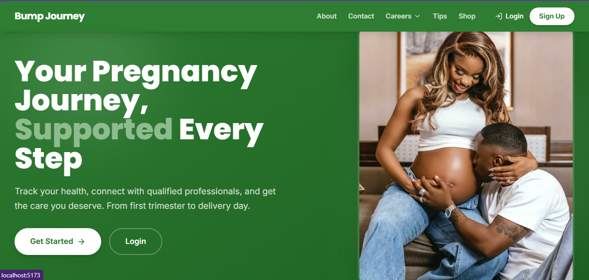
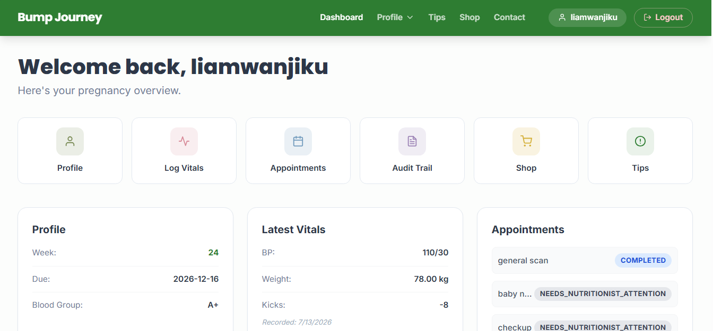
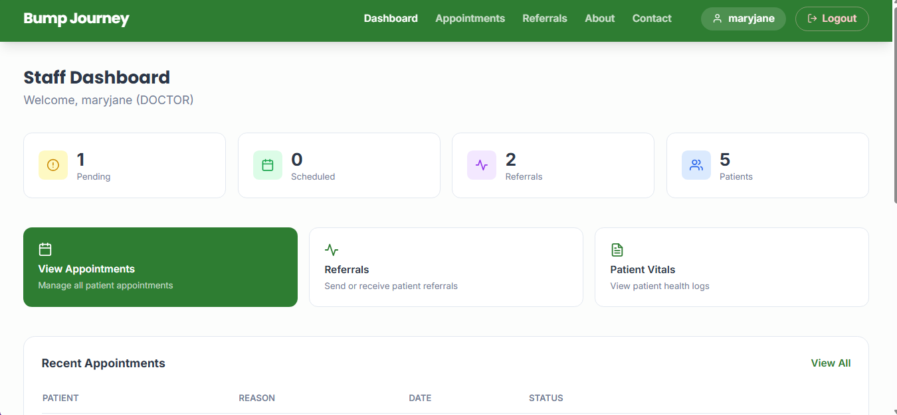
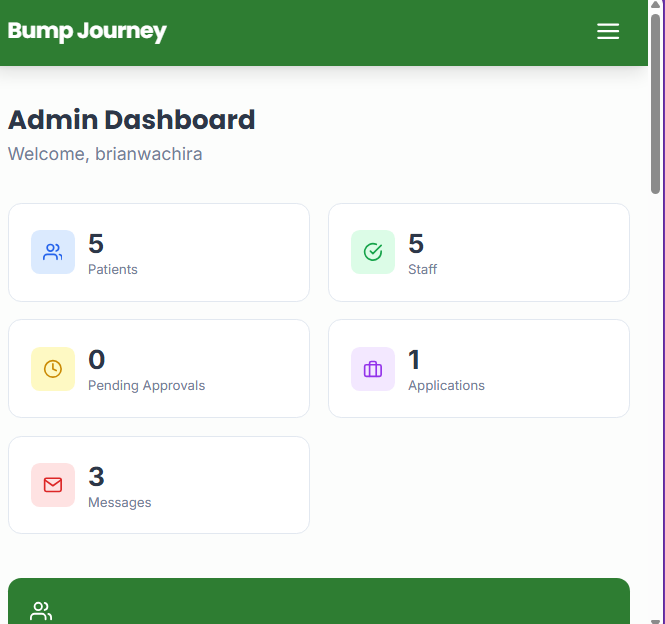

# BumpJourney 

BumpJourney is a comprehensive maternity care and pregnancy tracking platform designed to bridge the gap between expecting mothers and clinical staff (Doctors, Midwives, Nutritionists, Nurses, and Therapists). The platform streamlines appointment scheduling, vital health tracking, medical lock-ins, and peer-to-peer staff referrals, ensuring a safe, collaborative, and supported pregnancy journey.

---

##  Screen Shots

### Welcome Page



---

### Patient Dashboard




---

### Staff Dashboard



---

### Admin Dashboard
> *The administrative back-office to approve medical staff, manage site users, and view system-wide logs.*



---

##  Project Overview

Managing maternal healthcare requires seamless communication between various medical practitioners. **BumpJourney** addresses this by providing:
*   **For Patients:** A personal dashboard to book appointments, document pregnancy symptoms, log vitals, and view progress.
*   **For Staff:** An interactive workflow workspace where they can "lock" appointments they are handling, write clinical notes, and refer complex cases directly to specialists (e.g., Doctors referring to Nutritionists or Midwives) with real-time dashboard notification updates.
*   **For Admins:** Robust management tools to verify and approve newly registered medical practitioners before they enter the staff registry.

---

##  System Architecture
┌─────────────────────────────────────────────────────────┐
   │                   REACT FRONTEND (SPA)                  │
   │     - State Management (Context API)                    │
   │     - Responsive Design (Tailwind CSS, React Icons)     │
   └────────────────────────────┬────────────────────────────┘
                                │
                   HTTP / REST API Calls (Axios)
                                │
                                ▼
   ┌─────────────────────────────────────────────────────────┐
   │                   DJANGO REST BACKEND                   │
   │     - CORS Headers & Authentication Middleware           │
   │     - Routing Engine (Project & App Level URLs)         │
   └────────────────────────────┬────────────────────────────┘
                                │
                    Django ORM Database Queries
                                │
                                ▼
   ┌─────────────────────────────────────────────────────────┐
   │                   RELATIONAL DATABASE                   │
   │     - SQLite (Local Dev) / PostgreSQL (Production)      │
   │     - Tables: Users, Appointments, StaffNotes, Vitals   │
### Core Architecture Flows:
1.  **Authentication Flow:** Token-based authentication securely logs in users, mapping them to explicit custom roles (`PATIENT`, `DOCTOR`, `NUTRITIONIST`, `NURSE`, etc.).
2.  **Referral Pipeline:** When a staff member initiates a referral, the backend updates the appointment’s `referred_to` field, triggering a data-level query update. The targeted specialist's dashboard immediately flags the incoming case.

---

##  Technical Stack

| Category | Technology | Purpose |
| :--- | :--- | :--- |
| **Frontend** | React.js | Single Page Application (SPA) library |
| | Tailwind CSS | Utility-first styling framework |
| | React Icons | Iconography engine |
| | Axios | Promise-based HTTP client for API communication |
| **Backend** | Django | High-level Python Web Framework |
| | Django REST Framework (DRF) | Toolkit for building robust Web APIs |
| **Database** | SQLite / PostgreSQL | Relational database storage |
| **Security** | Django Cors Headers | Cross-Origin Resource Sharing (CORS) handling |

---

##  Future Improvements

I am continuously evolving BumpJourney. Below is our immediate developmental roadmap:

###  M-Pesa Integration (Maternity Shop)

*   **M-Pesa Express (STK Push):** Enable instant mobile checkout directly on the website. Mothers can enter their phone number and receive a secure PIN prompt on their phones to complete payments seamlessly.


---

##  Getting Started

### Prerequisites
*   Python 3.10+
*   Node.js (v16+)
*   npm 

### Backend Setup
1. Clone the repository and navigate to the project root:
   ```bash
   cd bump_journey_project
Create and activate a virtual environment:

Bash
python -m venv venv
# On Windows:
.\venv\Scripts\activate
# On macOS/Linux:
source venv/bin/activate
Install backend dependencies:

### Bash
pip install -r requirements.txtBash
python manage.py migrate
python manage.py runserver
## Frontend Setup
Navigate to the frontend directory:

Bash
cd frontend
Install Javascript dependencies:

Bash
npm install
Start the React development environment:

Bash
npm run dev